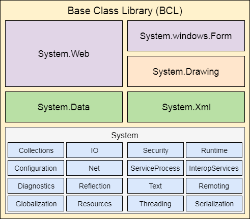

# Overview
This chapter discussed:
	- Windows API
	- Processes
	- Threads
	- Virtual Memory
	- Kernel and User Space 
	- Objects 
	- Handles 
	- Security 
	- Registry
It also coverd some tools to explore windows internals
	- Kernel Debugger
	- Preformance Monitor
	- Windows Driver Kit
	- Windows Software Dev Kit
	- Systernals Tools
		- (Intert Specific Tools here when know)


# Windows OS Versions
---
 Internal version numbers of windows OS moved from 5.0 to 6.0 with the release of vista. This caused errors in software developed b/c they usually only checked version  based on Major Numbers. For EX  int eh code below you can what the issue is. 
 ```
using System;
using System.Runtime.InteropServices;

[StructLayout(LayoutKind.Sequential)]
class OSVersionInfo {

    public int dwOSVersionInfoSize;
    public int dwMajorVersion;
    public int dwMinorVersion;
    public int dwBuildNumber;
    public int dwPlatformId;
    [MarshalAs(UnmanagedType.ByValTStr, SizeConst = 128)]
    public String szCSDVersion;
}

class MainClass {
    [DllImport("kernel32.dll")]
    public static extern bool GetVersionEx([In, Out] OSVersionInfo osvi);

    static void Main(string[] args) {
        OSVersionInfo osvi = new OSVersionInfo();
        osvi.dwOSVersionInfoSize = Marshal.SizeOf(osvi);
		
		GetVersionEx(osvi)
        
		if (osvi.dwMajorVersion = 5) {
			Continue
		}
		else{
			Fail. This is the issue with 
		} 

    }
}


 ```
 
 instead there are a few helper functions to determin the windows version. 
 `IsWindows8OrGreater()`, `IsWindows10OrGreater()`, `IsWindowsServer()`, etc...

## Windows 10
When looking at a version of windows 10 the key number is indicative of the year and month of version release. For example Win10 1607 was released in the year 2016 on the 07 month (July). Version 1511 would have been released in November 2015  

## One Core
The problem was maintaining all the code involved with many different versions of windows. Microsoft decided to merge all the Kernels and base platform supporting binaries into one core that woule be the foundation for all platforms (pc, xbox, mobile, etc). That means all devices are reg and policy based. 
# Foundations Concepts and Terms
---
## Windows API
**User-Mode** system to the windows os family
### Windows API Flavors
Since the Windows API is originally C style functions the sheer number of Functions made it overwhelming . The first main solution was to create new API functions using a Different API mechanism... COM 
**COM** is based on the interaction of COM Clients interaction with COM Server Objects through well-defined interfaces 

> The term COM Server typically refers to a Dynamic Link Library (DLL) or  executable (EXE) where the COM Classes are implemented

### Windows Runtime
- Windows 8, however, implimented a newer API and supporting runtime called **Windows Runtime (WinRT)**. 
- WinRT is built on top of COM. 
- Normal windows applications called *Windows Desktop Applications (Desktop Apps)* or Classic *Windows Applications*

### .NET Framework
**Common Language Runtime (CLR)** run-time engine which does Just-In-Time (JIT) compliation which translates the "bytecode" Common Intermediate Language (CIL) instructions to to opcodes used by the underlying hardware CPU. It is a COM in-process server (DLL). Note.. Remember note above that COM Server typically refers to DLL.

**.NET Framework Class Library (FCL)** Collection of types that implement functionality typically needed by client-server applications. This is important because it allows many programing languages to implement the same class to execute a task.  Different Namespaces to be used by programing languanges. 



As we can see in the example code above about windows versions we use the .Net Class Library's System namespace `using System.Runtime.InteropServices` because we want to use use unmanaged DLLs (Windows API) translated by platform invoke services. Specifically we use the `DllImportAttribute()` Class. The code is "Unmanaged" because, albeit user-space, is Native to the os and not the runtime enviorment (See below image). 


## Services, Functions, and Routines
Important Terms as defined in the book:
	- **Windows API Functions** Documented, Callable, subroutines in the Windows API. Ex: `CreateProcess()`
	- **Native System Services (syscalls)** undocumented, underlying services in the OS that are callable from user-space. Ex the `NtCreateUserProcess()` is what the the windows api  `CreateProcess()` calles to create a new process
	- **Kernel Support Functions (routines)** subroutines inside the Windows OS that can only be called from kernel mode. Ex `ExAllocatePoolWithTag()` is the routine the device drivers call to allocate memory from system heaps (or pools)
	- **Windows Services** Processes started by the windows service control manager. For example Task Scheduler service. 
	- **Dynamic Link Libaries  (DLL)** Callable subroutines that are linked together as a binary file. Windows will ensure there is only one instance of the code loaded into memory for all the programs that are refrencing it. 

### Process
- Process is the container of resources that are used to execute a program. That is the main difference... A program is just a set of instructions and a process will comprise of the following: 
	- Private Virtual address space: 
	- Executable Program:
	- Listing of open Handles: Various system resources accessable to all threads within the process. May include semaphores, sync objects, files
	- Security Context: Access Token(s) 
	- Process ID:
	- Atlease 1 thread of execution:

**Parrent Process** a process will refer to a parent which may or may not be the creator process. For example, if a PPID no longer exists. The process does not rely on the Parent process. A reason for this is if a user application requires the help of a broker process to call the process create API. In this event, the Parent process id would be potentially incorrect


### Threads
**Thread** is an entity within a process that Windows and schedules for execution. It includes and accessable by `GetThreadContext`:
-	set of CPU registers that represent the state of the processor
-	Two Stacks one for Kernel Mode and one of User Mode
-	private storage Thread Local Storage (TLS) for use by subsystems, run-time lib, and DLLs.
-	Thread ID
	

#### Fibers
Fibers can be thought of as light weight threads. They are are implimented in kernel32.dll and therefore completely in userspace. To use a fiber you must first make a call to `ConvertThreadToFiber`. From within the new fiber you can use `CreateFiber` however IOT begin execution you must call `SwitchToFiber` and it will run until you call the same function again to stop
#### User-Mode Scheduling (UMS) Threads
UMS Threads are a 64-bit technology and simular to a fiber. However, UMS will create a kernel level thread for preforming kernel actions like a syscall. 
### Jobs

### Virtual Memory

### Kernel Mode vs User Mode

### Hypervisor

### Firmware

### Terminal Services and Multipule Sessions

### Objects and Handles

### Security

### Registry

### Unicode

## Digging into Windows Internals

### Preformance Monitor and Resource Monitor

### Kernel Debugging 

### Windows Software Development Kit

### Windows Driver Kit

### Sysinternals Tools


# Undocumented APIs listed 
- `NtSuspendProcess` Native API will place a process in a suspended state. This means all threads in the process.